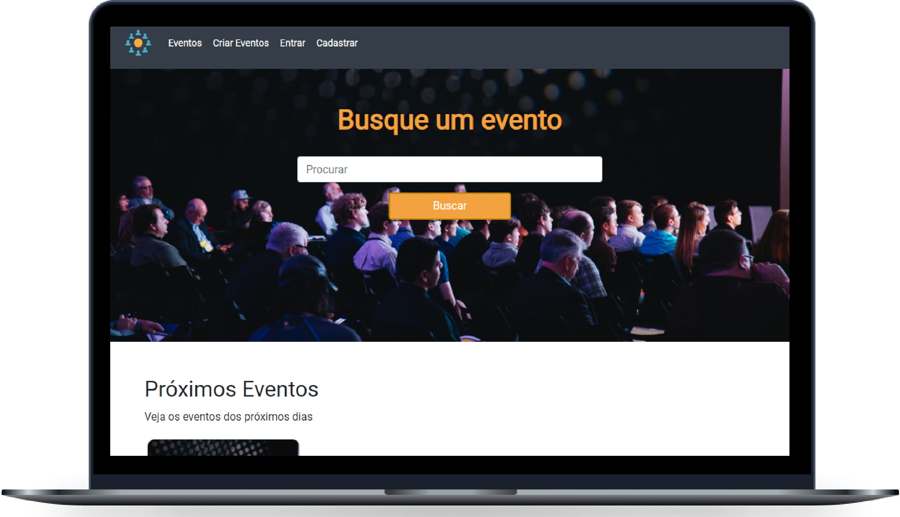

<h1 align="center">
    <p>Events</p>
</h1>

<p align="center">
  <a href="#-tecnologias">Tecnologias</a>&nbsp;&nbsp;&nbsp;|&nbsp;&nbsp;&nbsp;
  <a href="#-projeto">Projeto</a>&nbsp;&nbsp;&nbsp;|&nbsp;&nbsp;&nbsp;
  <a href="#-funcionamento">Obtendo e executando o projeto</a>&nbsp;&nbsp;&nbsp;|&nbsp;&nbsp;&nbsp;

</p>

<p align="center">
  
  
  
</p>

<br>

<p align="center">
  
</p>

## 🚀 Tecnologias

Esse projeto foi desenvolvido com as seguintes tecnologias:

-   [HTML](https://www.w3schools.com/html/)
-   [CSS](https://www.w3schools.com/css/)
-   [Bootstrap](https://getbootstrap.com/)
-   [PHP](https://www.php.net/)
-   [Laravel](https://laravel.com/)

## 💻 Projeto

Events é um site que oferece a possibilidade criar e Conectar-se a eventos locais para conhecer pessoas e receber novos conhecimentos e experiências.

## 🌐 Funcionamento

```bash
# 1º Instale o Laravel seguindo as instruções no link abaixo:
https://laravel.com/docs/8.x/installation

# 2º Clone o repositório com o comando abaixo:
git clone https://github.com/aldotheapache1/Events-Laravel.git

# 3º Crie ou modifique o arquivo .env com as informações da sua base de dados

# 4º Após a conexão do banco de dados estiver estabelecida, execute o comando abaixo, para criar a estrutura no seu banco de dados.
php artisan migrate

# 5º Por fim, execute o comando abaixo e acesse em seu navegador o endereço: http://127.0.0.1:8000
php artisan serve

```
